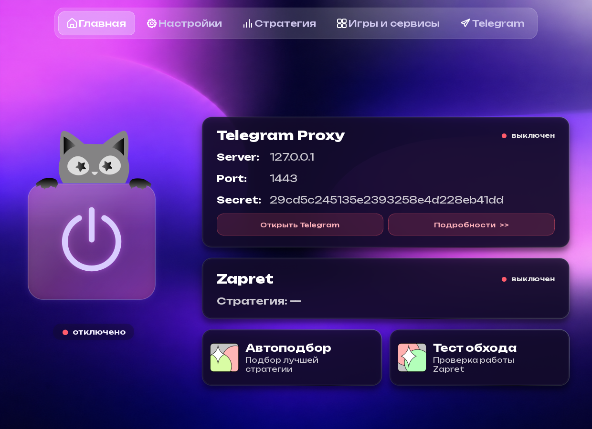
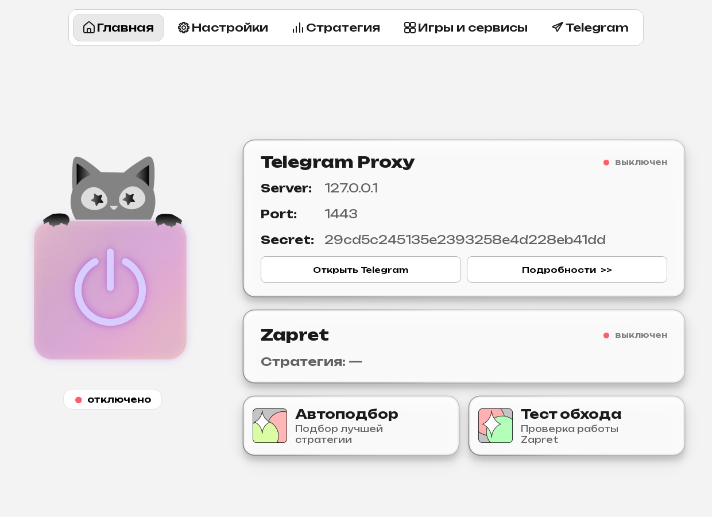

<div align="center">


<br>

[](https://github.com/Tchk-zz/cat-zapret/releases/latest)
[](https://github.com/Tchk-zz/cat-zapret/actions/workflows/tests.yml)
[](#системные-требования)
[](LICENSE)

**Независимый графический интерфейс для управления Zapret на Windows.**<br>
Запуск, подбор стратегий, диагностика, полное обновление upstream-компонентов и Telegram-прокси — в одном приложении.

[**⬇ Скачать последнюю версию**](https://github.com/Tchk-zz/cat-zapret/releases/latest) · [Что изменилось](CHANGELOG.md) · [Сообщить об ошибке](https://github.com/Tchk-zz/cat-zapret/issues/new/choose)

</div>

> [!IMPORTANT]
> Приложению нужны права администратора для управления WinDivert и `winws.exe`. Защитник Windows и другие антивирусы иногда считают инструменты фильтрации сети подозрительными — скачивайте установщик только из [официальных Releases](https://github.com/Tchk-zz/cat-zapret/releases) и сверяйте SHA-256 из описания релиза.

## Зачем нужен Zapret GUI

Zapret GUI превращает набор BAT-стратегий и сетевых компонентов в понятное приложение: показывает состояние движка, помогает подобрать рабочий вариант, проверяет доступность сервисов и безопасно обновляет всю поставку Zapret.

| Возможность | Что делает |
|---|---|
| 🚀 **Запуск в один клик** | Управляет Zapret, автозапуском и игровым фильтром без ручной работы с BAT-файлами. |
| ✨ **Автоподбор** | Проверяет стратегии и помогает выбрать подходящую для текущей сети. |
| 🧪 **Тест обхода** | Диагностирует доступность и отличает реальный ответ от страницы блокировки провайдера. |
| 🔄 **Полное обновление Zapret** | Обновляет стратегии, `lists`, HOSTS, IPSet, `.service`, `service.bat`, `bin`, `utils` и новые upstream-файлы. |
| 🛡️ **Транзакционная установка** | Проверяет архив до записи, применяет изменения через staging и откатывает их при ошибке. |
| ✈️ **Telegram proxy** | Устанавливает и обновляет встроенный WebSocket-прокси полным проверенным пакетом. |
| 🎨 **10 тем** | Светлые и тёмные варианты интерфейса с сохранением выбранного оформления. |

## Интерфейс

<table>
  <tr>
    <td width="50%"></td>
    <td width="50%"></td>
  </tr>
  <tr>
    <td align="center"><b>Фиолетовая тема</b></td>
    <td align="center"><b>Светлая тема</b></td>
  </tr>
</table>

## Обновления без потери настроек

Кнопка **«Обновить Zapret»** синхронизирует не только стратегии. Начиная с 1.9.6 приложение собирает полный upstream bundle из release asset и исходного архива соответствующего тега.

**Обновляется:**

- BAT-стратегии и `service.bat`;
- `lists/`, HOSTS, IPSet и скрытая `.service`;
- `bin/`, `utils/`, драйверы и новые upstream-файлы;
- состав пакета: исчезнувшие управляемые upstream-файлы удаляются по манифесту.

**Всегда сохраняется:**

- `lists/*-user.txt` и пользовательские списки;
- `config.json`, выбранная стратегия и настройки интерфейса;
- пользовательские стратегии и состояние игрового фильтра;
- неизвестные локальные файлы, не принадлежащие управляемой upstream-поставке.

Перед применением архив проверяется на лимиты размера, ZIP-bomb, шифрованные записи, symlink/path traversal и обязательный состав ядра. Если запись не завершилась, изменения откатываются.

## Установка

### Системные требования

- Windows 10 или Windows 11, x64;
- права администратора;
- подключение к интернету для проверки и загрузки обновлений.

### Обычная установка

1. Откройте [последний релиз](https://github.com/Tchk-zz/cat-zapret/releases/latest).
2. Скачайте **`ZapretGUI-Setup.exe`**.
3. При желании сверьте SHA-256 файла с хешем в описании релиза.
4. Запустите установщик и затем Zapret GUI.

> [!WARNING]
> В версиях **1.9.5 и 1.9.6** обнаружена ошибка запуска скачанного установщика: Windows могла искать путь с лишними кавычками. Если встроенное обновление показывает ошибку «не удаётся найти файл», один раз установите 1.9.7 вручную из Releases. Начиная с 1.9.7 механизм исправлен.

## Быстрый старт

1. Откройте приложение от имени администратора.
2. Нажмите **«Обновить Zapret»**, чтобы получить актуальные компоненты.
3. Выберите стратегию вручную или запустите **«Автоподбор»**.
4. Нажмите запуск и проверьте результат через **«Тест обхода»**.
5. При необходимости включите автозапуск или настройте Telegram-прокси.

<details>
<summary><b>Если обход не заработал</b></summary>

1. Обновите Zapret и повторите автоподбор.
2. Проверьте, не удалил ли антивирус `winws.exe` или WinDivert.
3. Временно отключите конфликтующее VPN/фильтрующее ПО и повторите тест.
4. Приложите к Issue версию Windows, версию Zapret GUI, название стратегии и обезличенный журнал. Не публикуйте IP-адреса, токены, прокси-пароли и персональные пути без необходимости.

</details>

## Безопасность

- установщик запускается только после проверки опубликованного GitHub SHA-256;
- загрузки имеют жёсткие лимиты размера и проверяются до выполнения;
- обновления Zapret и Telegram proxy проходят staging, валидацию и rollback;
- TLS-проверка не отключается;
- пользовательские данные не отправляются разработчику автоматически.

Правила ответственного раскрытия находятся в [SECURITY.md](SECURITY.md). Технические результаты аудита — в [docs/SECURITY_AUDIT.md](docs/SECURITY_AUDIT.md).

## Разработка

```powershell
py -m venv .venv
.\.venv\Scripts\Activate.ps1
pip install -r requirements.txt -r requirements-dev.txt
python -m pytest tests/ -q
python tools/check_lint.py
python tools/check_vulnerabilities.py
```

Сборка и публикация выполняются воспроизводимо через GitHub Actions. Подробности: [CONTRIBUTING.md](CONTRIBUTING.md) и [RELEASE_CHECKLIST.md](RELEASE_CHECKLIST.md).

## Благодарности и лицензии

Zapret GUI — независимый проект и не является официальным интерфейсом upstream-разработчиков.

- [Flowseal/zapret-discord-youtube](https://github.com/Flowseal/zapret-discord-youtube) — Windows-поставка стратегий и списков;
- [bol-van/zapret](https://github.com/bol-van/zapret) — оригинальный проект Zapret;
- [Flowseal/tg-ws-proxy](https://github.com/Flowseal/tg-ws-proxy) — основа встроенного Telegram WebSocket proxy;
- [WinDivert](https://github.com/basil00/WinDivert) — перехват и модификация сетевых пакетов;
- [PyQt6](https://pypi.org/project/PyQt6/) — графический интерфейс.

Собственный код распространяется по **GPL-3.0-only**. Точные уведомления и лицензии сторонних компонентов: [THIRD_PARTY_NOTICES.md](THIRD_PARTY_NOTICES.md) и [NOTICE](NOTICE).

---

<div align="center">

Сделано с заботой о понятных обновлениях и безопасном откате · [Tchk-zz](https://github.com/Tchk-zz)

</div>
